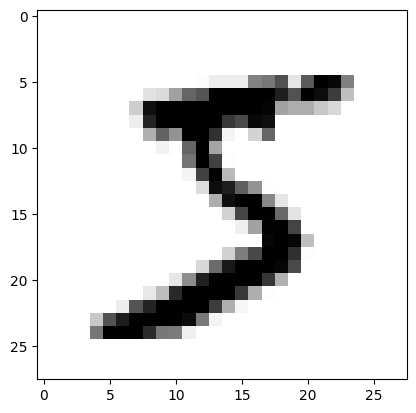
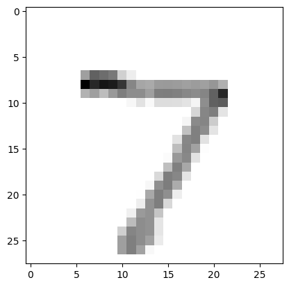
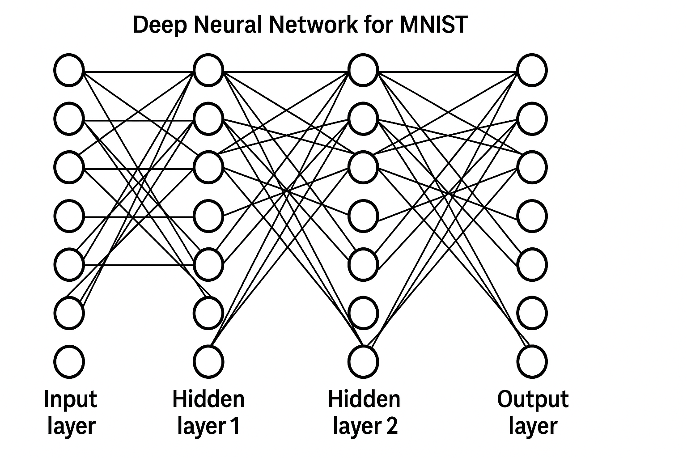
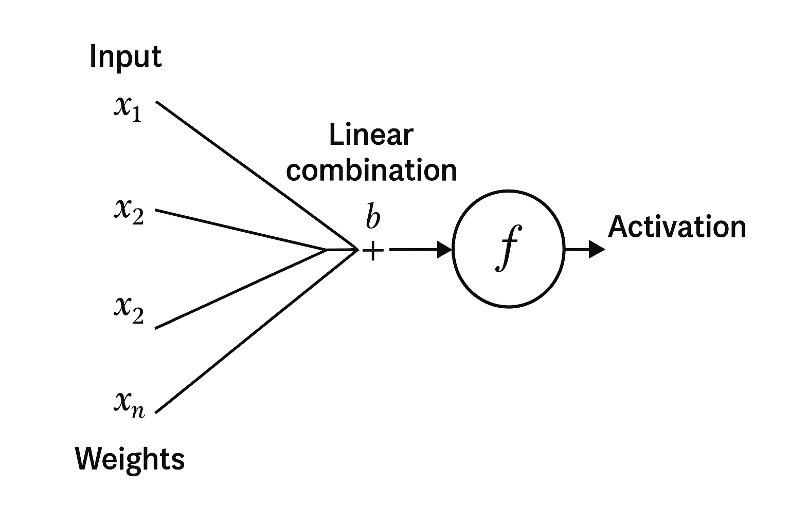
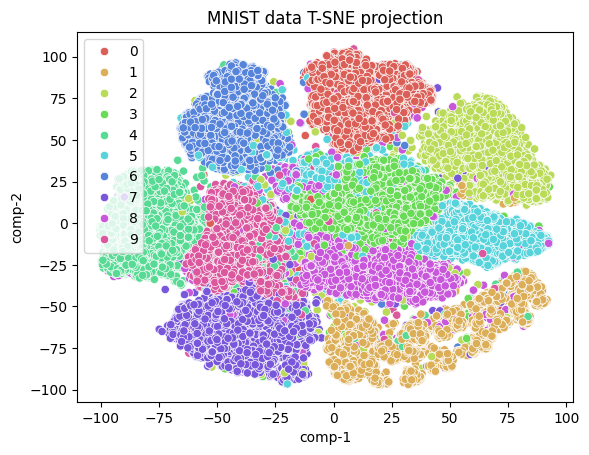
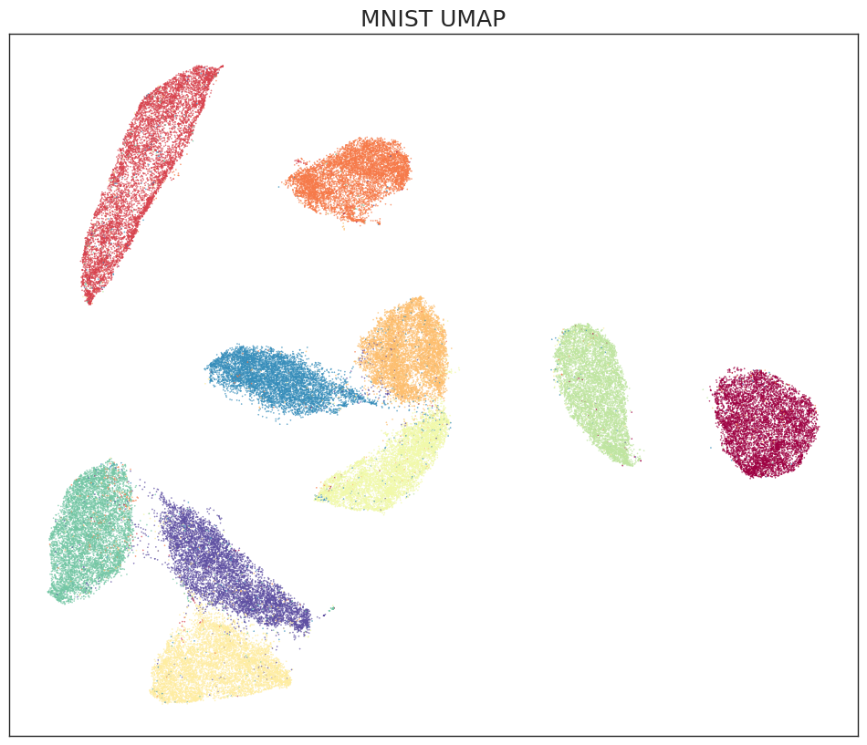

# MNIST-classification

Analyze the classic MNIST dataset using DNN, t-SNE, UMAP (and VAE coming up later)

Sample images:

Using t-SNE:

Using umap:

See details in [notebook](mnist_modelling.ipynb)
