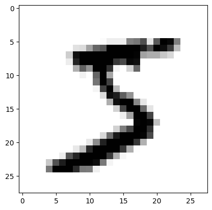
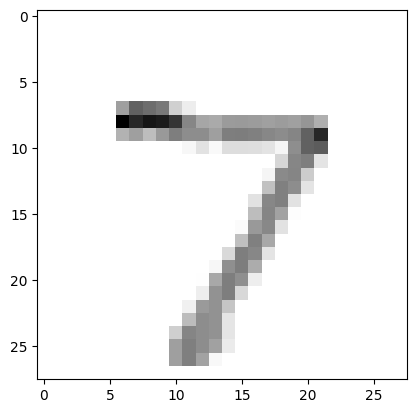
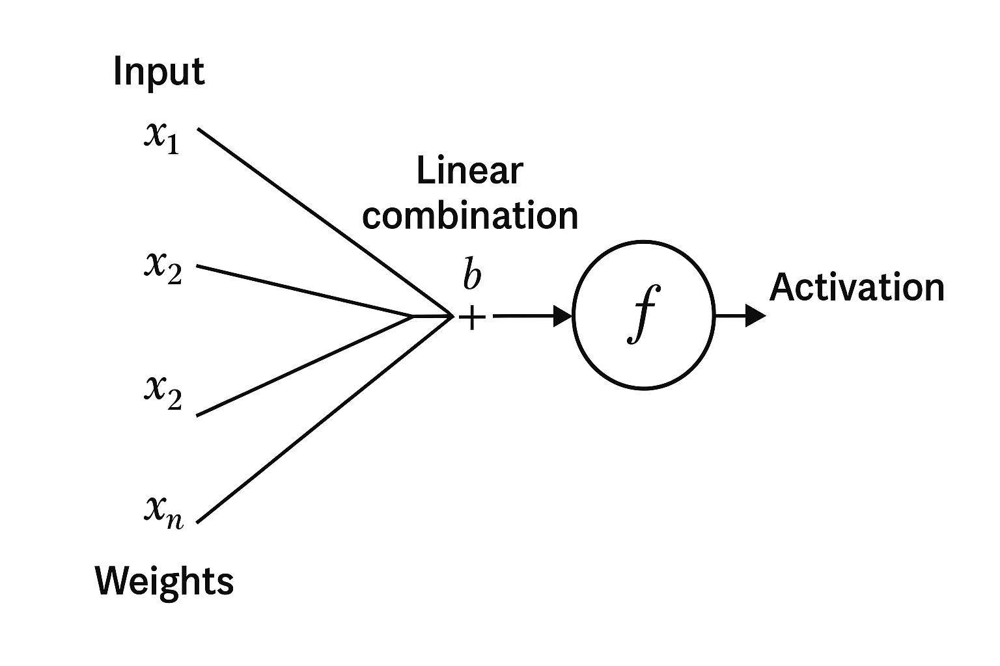
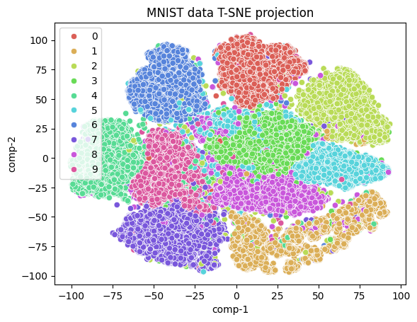

# MNIST-classification

Analyze the classic MNIST dataset using DNN, t-SNE, UMAP (VAE maybe coming up later).

## MNIST Dataset Overview

MNIST is a dataset of 70,000 grayscale images of handwritten digits (0–9), each of size 28×28 pixels → 784 dimensions .
It’s often used for benchmarking machine learning algorithms, especially in visualization tasks.

Sample images:

|  |  |
| :------: | :------: |

|  |  |
| :------: | :------: |

## Goal of Dimensionality Reduction

We want to reduce the high-dimensional data (784D) into 2D or 3D so we can visualize it, while preserving important structure like:
- Clusters of similar digits
- Separation between different digit classes

This is where t-SNE and UMAP come in.

|  |  |
| :------: | :------: |

## t-SNE: t-Distributed Stochastic Neighbor Embedding

t-SNE focuses on preserving local structure — meaning it tries to keep nearby points in high-dimensional space nearby in low-dimensional space.

🔍 How it works (simplified):
Converts distances between points in high-dimensional space into probabilities (similar to similarities).
Does the same in low-dimensional space.
Minimizes the difference between these probability distributions using gradient descent .
Uses a t-distribution in the low-dimensional space to avoid the "crowding problem".
📊 Applied to MNIST:
After applying t-SNE to MNIST, you typically get a 2D plot where:
Each point represents a digit image.
Points are colored by their true label (0–9).
Similar digits cluster together.

⚠️ Pros & Cons:

| PROS | CONS |
| :------: | :------: |
| Excellent at preserving local neighborhoods | Computationally expensive |
| Good for visualizing clusters | Not good at preserving global structure |
| Random initialization can affect results | Not deterministic |

Note: t-SNE tends to create well-separated, tight clusters but may distort the relative distances between clusters.

## UMAP: Uniform Manifold Approximation and Projection

UMAP also preserves local structure, but also tries to preserve some global structure, making it better for understanding overall relationships in the data.

🔍 How it works (intuitively):
Assumes data lies on a manifold (a curved surface embedded in high-dimensional space).
Constructs a topological representation (graph) of the data.
Finds a similar graph in low-dimensional space that minimizes differences.
UMAP is faster than t-SNE and scales better to larger datasets.

📊 Applied to MNIST:
Like t-SNE, UMAP reduces MNIST to 2D/3D for visualization.
Digits form clusters with clearer separation and more meaningful spacing between digit classes.
Global relationships (e.g., digit 0 far from digit 1, closer to 6 or 9) are often better preserved.

⚠️ Pros & Cons:

| PROS | CONS |
| :------: | :------: |
| Faster than t-SNE | Slightly newer and less mature |
| Preserves both local and some global structure | More hyperparameters to tune |
| Scalable to large datasets | Can be harder to interpret in edge cases |

📈 Visual Comparison on MNIST
Here's what you'd typically see when plotting both methods:

| METHOD | CLUSTER SHAPE | GLOBAL STRUCTURE | SPEED |
| :------: | :------: | :------: | :------: |
| t-SNE | Compact, isolated clusters | Poorly preserved | Slow |
| UMAP | More spread out, connected clusters | Better preserved | Fast |

For example, UMAP might show a smooth transition between 5 and 3 if they appear similar in some samples, while t-SNE might treat them as fully separate. 

## Code examples

See details in [notebook](mnist_modelling.ipynb)

Both t-SNE and UMAP are great tools, but UMAP is often preferred nowadays due to its speed and better preservation of global structure.
